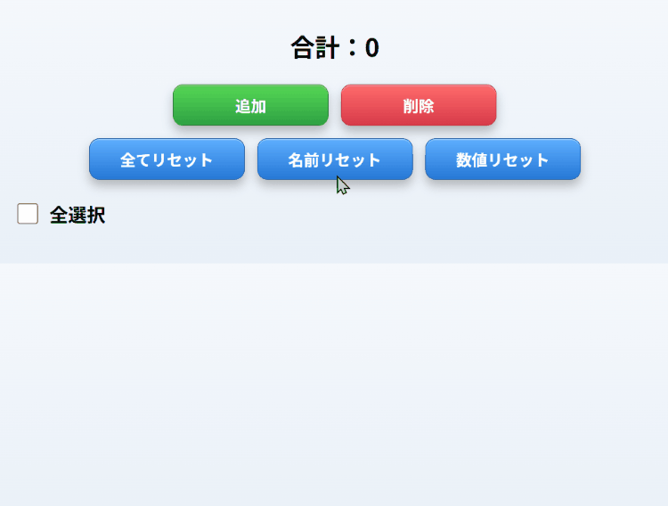

# マルチカウンターアプリ

## 公開URL
https://multi-counter-web.vercel.app/

## アプリ概要
複数項目の数値を計測し、任意の項目の合計を算出できるマルチカウンターアプリです。

## 作成したきっかけ
アルバイト先で行っているサイトパトロール業務では、1日の業務終了後、日報に口コミ総件数・編集件数・削除件数を集計して記録する必要があります。  
既存のカウンターアプリでは、任意の項目の合計を計算する機能が不足していたので、業務を効率化する目的で本アプリを開発しました。

## 主な機能
- カウンター追加
- カウンター削除
- 項目名の編集
- 数値の直接入力
- ＋／－ボタンによるカウント
- 全選択機能
- チェックした項目のみ合計表示
- 名前リセット
- 数値リセット
- 全リセット
- LocalStorageによるデータ保存

## 使用技術
### フロントエンド
- HTML5
- CSS3
- JavaScript (ES6+)
### ビルドツール
- Vite
### データ保存
- LocalStorage
### デプロイ
- Vercel
### バージョン管理
- Git
- GitHub

## 開発環境
- Node.js v24.14.0
- npm 11.9.0
- Vite 7.3.6

## 工夫した点
- イベント委譲を採用しているため、追加したカウンターにもイベントが自動的に適用されます。
- LocalStorageを利用し、ブラウザを閉じてもデータが保存されます。
- 役割毎にフォルダを分割し、各処理を明確化しました。
  - mainフォルダ：アプリの起動
  - controllersフォルダ：イベント処理・アプリ全体の制御
  - modelsフォルダ：カウンターデータの管理
  - viewsフォルダ：HTML生成
  - servicesフォルダ：LocalStorageへの保存・読込
  - utilsフォルダ：共通処理

## 今後追加したい機能
- クラウド保存機能
- ドラッグ＆ドロップによる並び替え